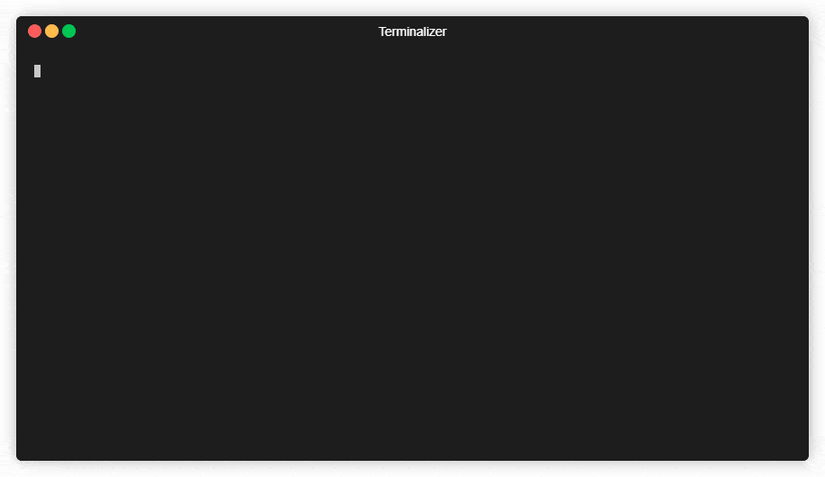
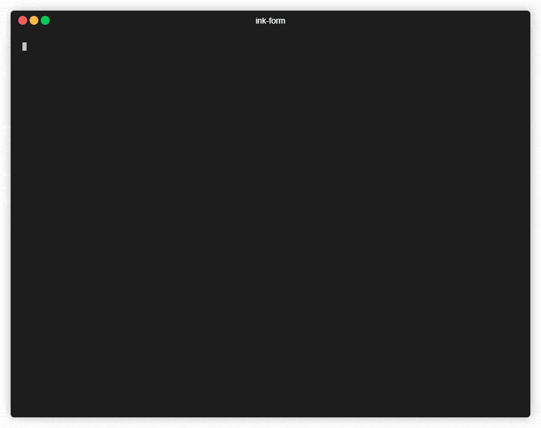

# ink-form

``ink-form`` is a Node library for displaying a user-friendly form in a terminal window.
It can be used in two ways, either by using the React Ink component ``Form`` exported by
the package, or by using the imperative API ``openForm(options)``.





## Example usage

    npm install ink-form

```typescript
const options = [{ label: 'Opt 1', value: 'a' }, { label: 'Opt 2', value: 'b' }];

const form: FormProps = {
  form: {
    title: "Form title",
    sections: [
      {
        title: "Text and Number fields",
        fields: [
          { type: 'string', name: 'field1', label: 'Input with initial value', initialValue: 'Initial value' },
          { type: 'string', name: 'field2', label: 'Masked input', mask: '*' },
          { type: 'integer', name: 'field3', label: 'Integer between -5 and 8, stepsize 2', min: -5, max: 8, step: 2 },
          { type: 'float', name: 'field4', label: 'Float between 0 and 5, stepsize 0.1', min: 0, max: 5, step: .1 },
        ]
      },
      {
        title: "Select and boolean fields",
        fields: [
          { type: 'select', name: 'field5', label: 'Select', options },
          { type: 'multiselect', name: 'field6', label: 'Multi Select', options },
          { type: 'boolean', name: 'field7', label: 'Boolean select', options },
        ]
      }
    ]
  }
};

(async () => {
  const result = await openForm(form);
  console.log(`Finished with value`, result);
})();
```

## Documentation

[TODO]


## Custom fields

[TODO]

